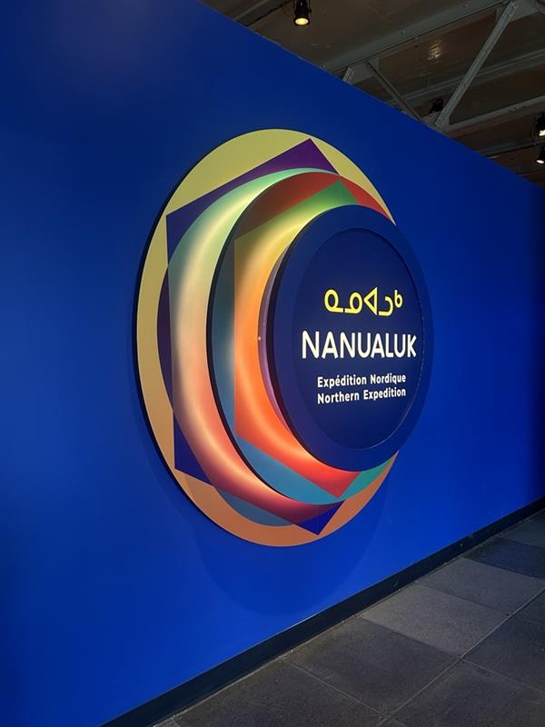
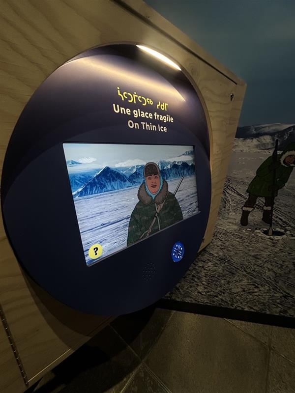
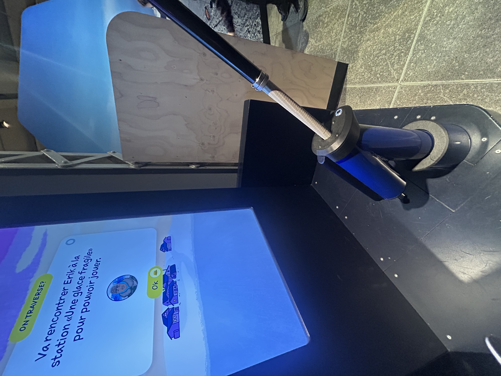
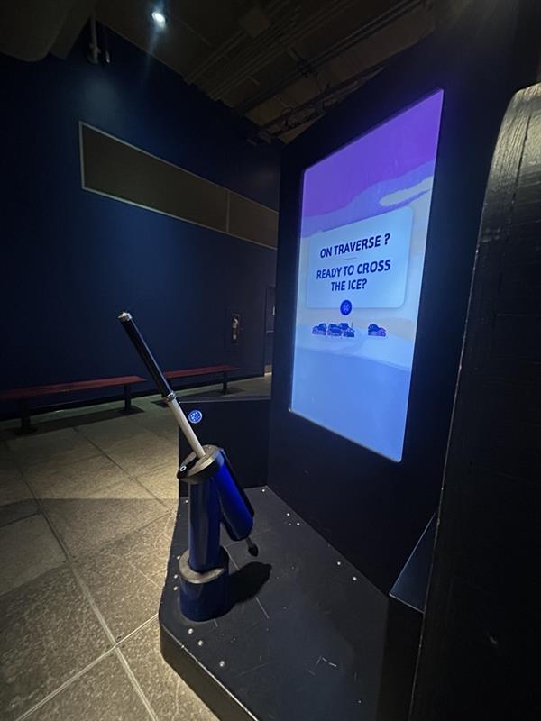
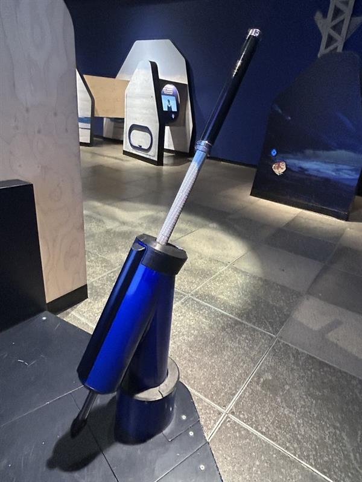
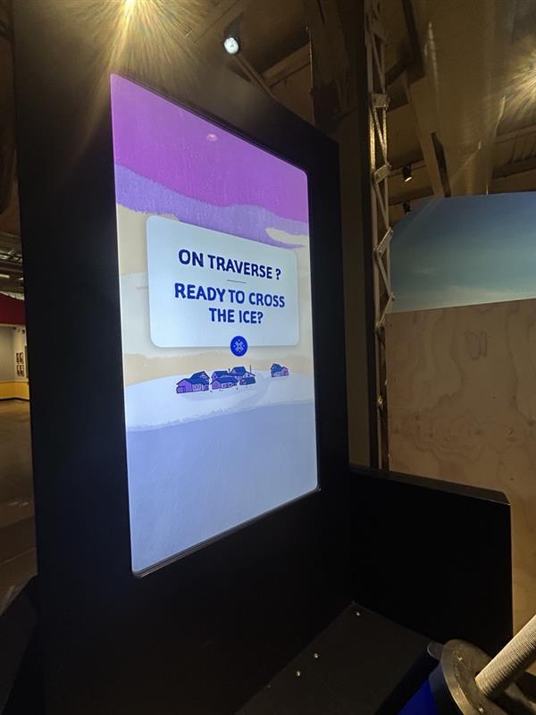
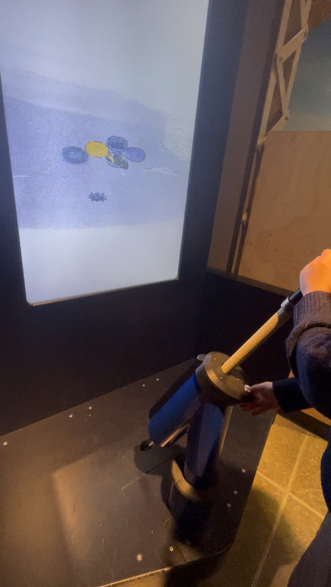

# Nanualuk – Expédition Nordique  
## Centre des sciences  

## Type d’exposition :  intérieur permanente  
### Date de visite :  1 avril 2026
# Une Glace Fragile 

## Artistes / Organisation  
- Centre des sciences de Montréal  
- Collaboration avec des communautés inuites  
## Année : 2019
## Description: Cette installation interactive permet aux visiteurs de tester la solidité de la glace afin de se déplacer de façon sécuritaire dans un environnement nordique. À l’aide d’un manche, le participant doit pousser sur la surface glacée pour vérifier si elle risque de se briser. L’objectif est de trouver un chemin sécuritaire pour éviter que le véhicule ne tombe dans l’eau. Cette activité met en évidence les dangers liés aux déplacements sur la glace et sensibilise aux conditions changeantes du climat nordique.

##### Il n'y avait pas de cartel précis
## Type d’installation: Immersive et interactive  

## Fonction du dispositif:  
>Mise en contexte, support pédagogique, diffusion du patrimoine immatériel  
## Mise en espace  

## Composantes et techniques  

> Écrans interactifs, sons ambiants, éclairage immersif, badges , cercles lumineux, objets inuits, manche
## Éléments nécessaires  

> Salles sombres, projecteurs, écrans  
## Expérience vécue  

#### Appréciation: L’exposition est très immersive et permet de mieux comprendre la culture inuite et les réalités du Nord. Les effets visuels et sonores rendent l’expérience engageante et amusante!  
#### Critique: Certains dispositifs pourraient être plus interactifs ou donner plus de liberté.  
### Références:  
#### Photos prise par Rosa-Lee Savoie
