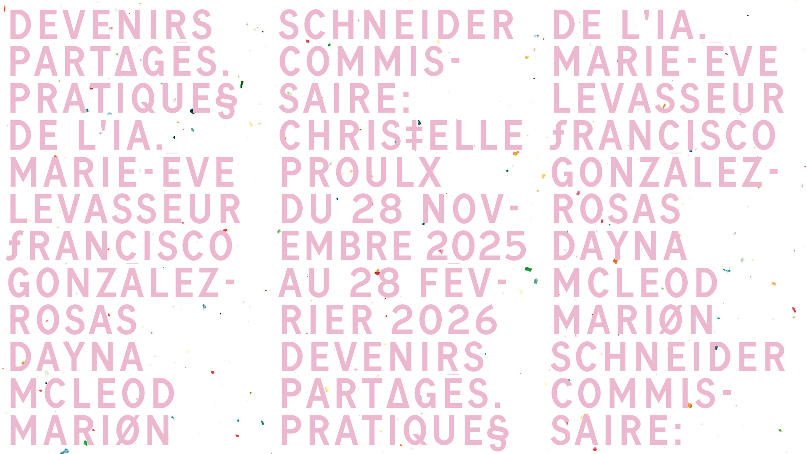
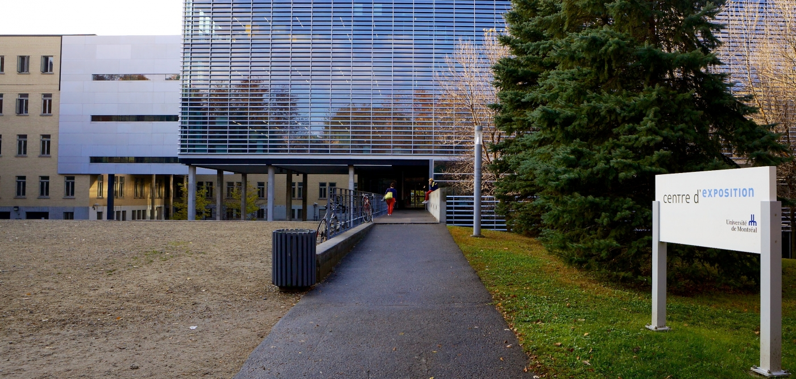
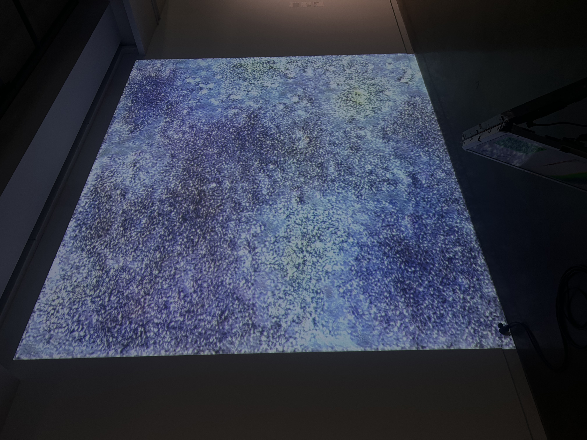
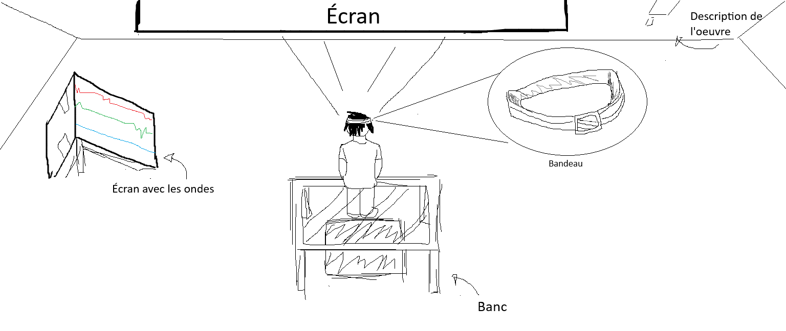
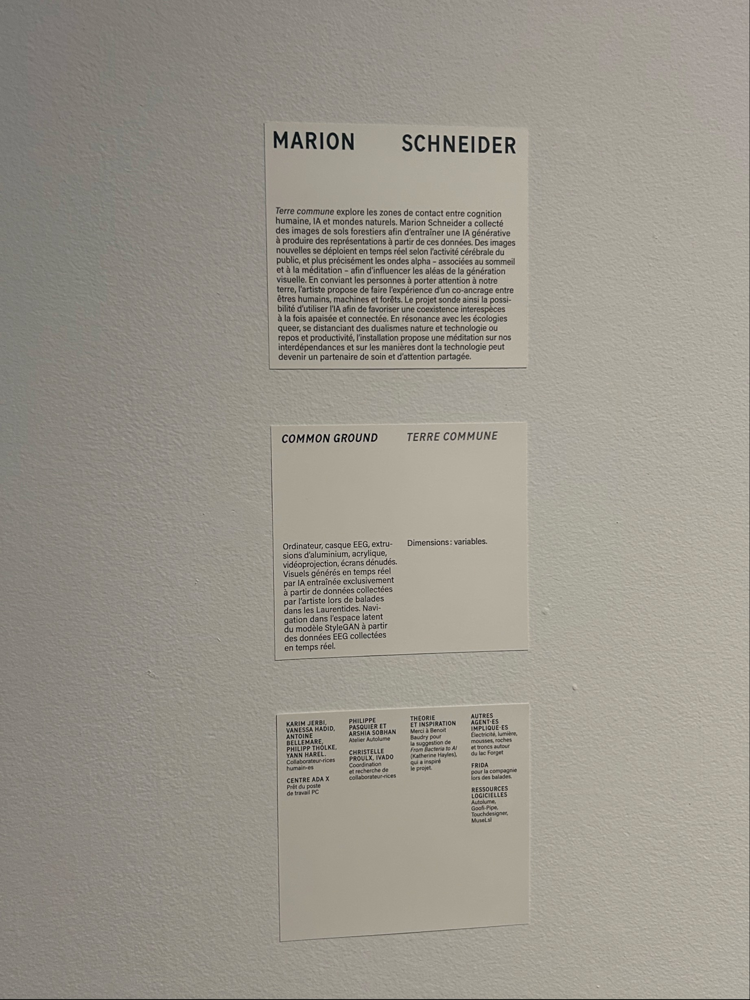
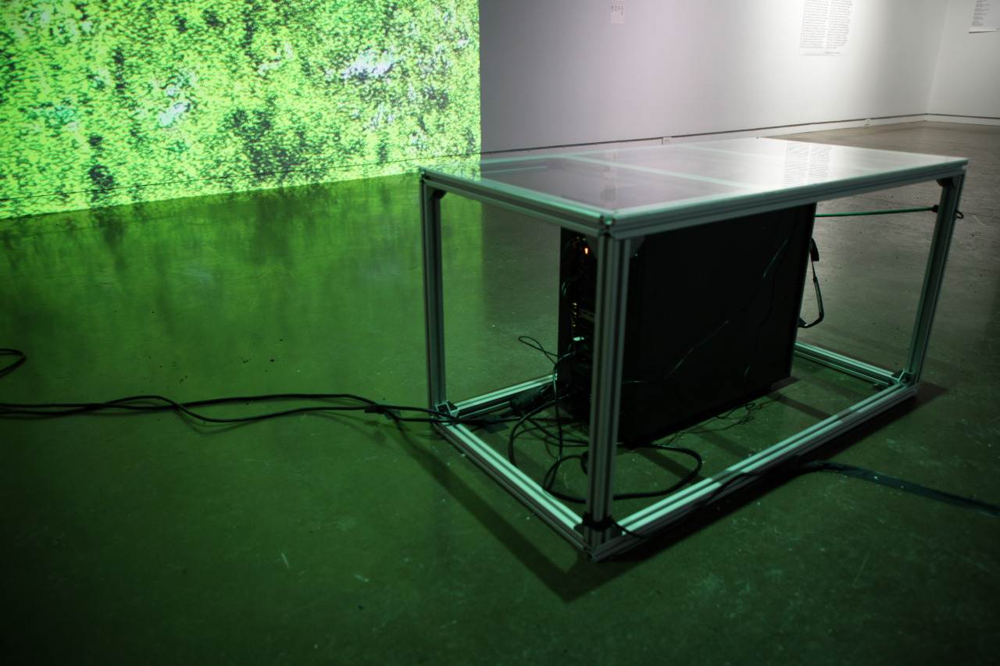
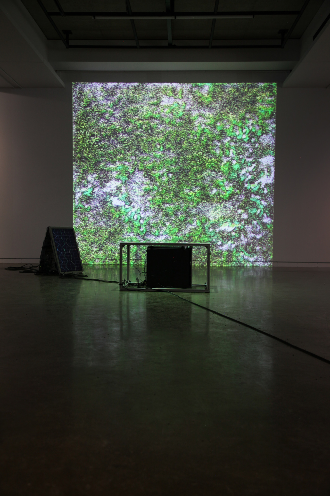
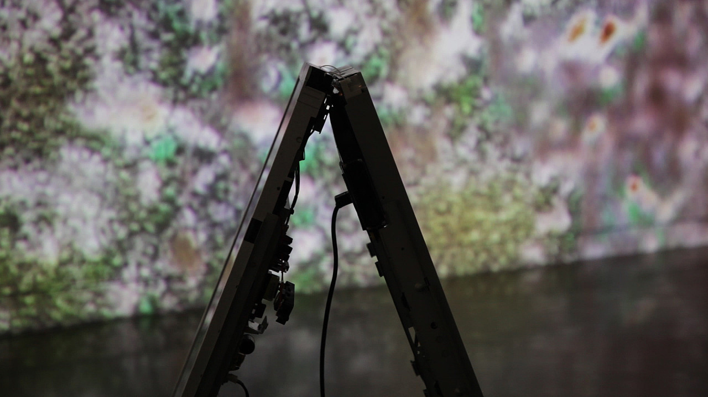
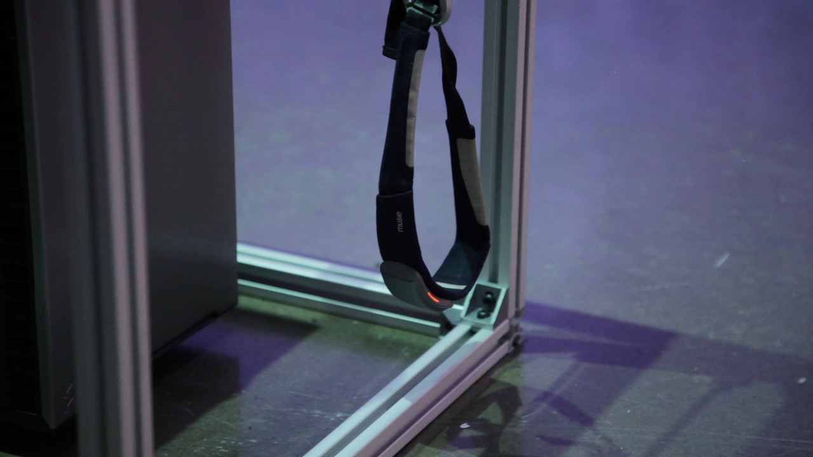

# Devenir partage pratique de l'IA

###### Photo prise dans le site dans les références.
## Galerie de l'Université de Montréal

###### Photo prise dans le site dans les références.
## Type d'exposition: Temporaire intérieur
### Date de visite: 30 Janvier 2026
# Common Ground/Terre commune

# Croquis de l'oeuvre

## Artiste: Marion Schneider

###### Photo prise dans le site dans les références.
### Cette oeuvre à été realisée en 2025
### Marion Scheinder a collecté des images de sols forestiers afin d'entraîner une  AI générative à produire des représentation à partir de ces données. Des images se déploient en temps réel selon l'activité cérébrale du public avec des ondes alpha

### Une installation Interactive

###### Photo prise dans le site dans les références.
### Fonction du dispositif multimédia: Scénographie
### Mise en espace: Écran et projecteur

###### Photo prise dans le site dans les références.
### Composantes et techniques: Écran-Projecteur-Bandeaux qui lit les ondes alphas

###### Photo prise dans le site dans les références.
### Éléments nécessaires: Écran-Banc-Bandeaux

###### Photo prise dans le site dans les références.
#### Appréciation: J'ai bien apprécié l'experience, l'oeuvre était intéressant. Aussi, le fait qu'on pouvait interagir avec l'oeuvre était un belle aspect. L'oeuvre pouvait changer avec nos ondes alphas fait par notre tête est très impressionnant.
#### Commentaires constructifs: Ce qui ma plu était le fait qu'on pouvais observé les ondes bougées. On obervait les ondes changées si on pensait à quelque chose, vivait une émotions forte ou même à rien du tout. Par example si tu pensais à quelque chose de positif ou d'amusant les ondes bougaient partout. Mais si tu ne pense à rien, les ondes reste en ligne droite.
#### Critiques: L'Aspect que je souhaiterais pas retenir pour mes propre créations est l'appui visuel, je trouve qu'il n'avait rien de spécial au changement de couleur comparer aux ondes
### Références: Les sites de références pour les images: https://schneidermarion.net/ / https://galerie.umontreal.ca/ / https://museesmontreal.org/en/museums/galerie-de-luniversite-de-montreal / https://www.marionschneider.net/die-dunkle-seite-des-mondes/
