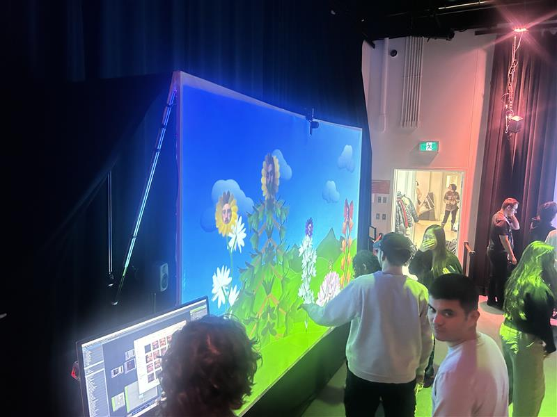
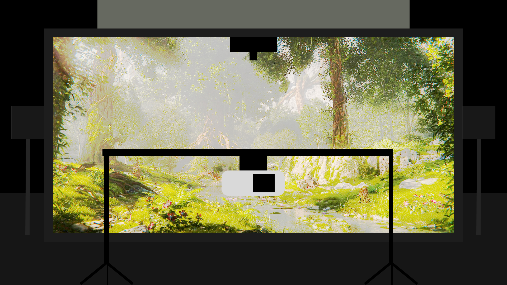
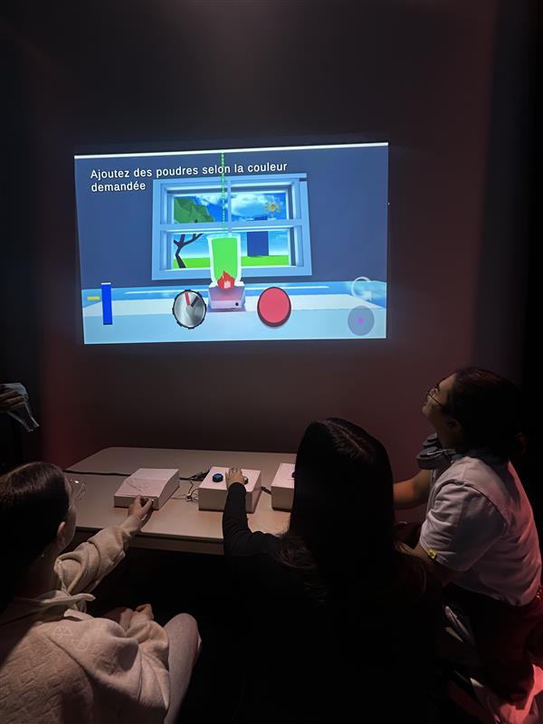
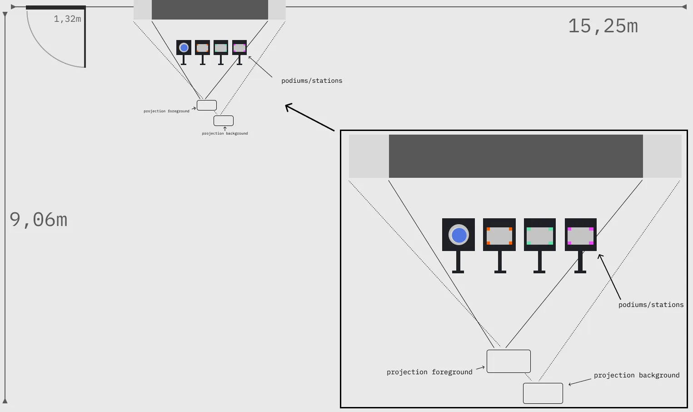
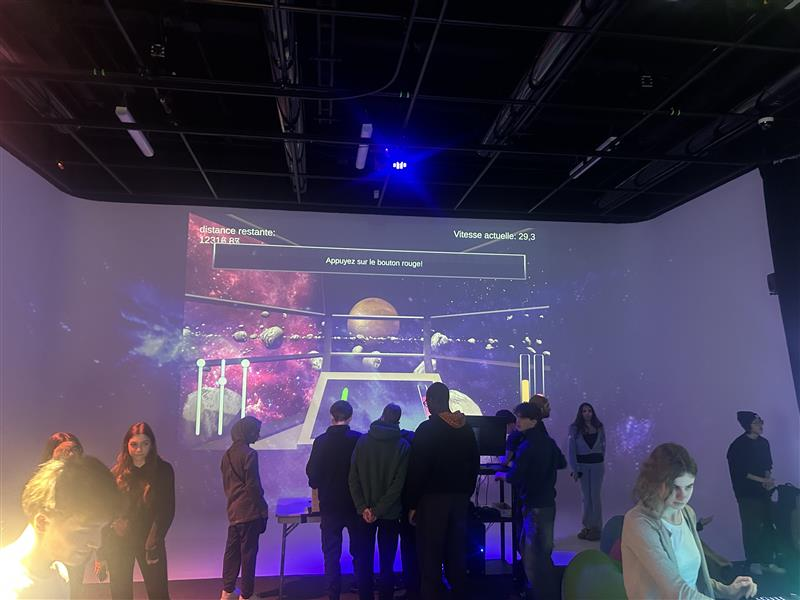
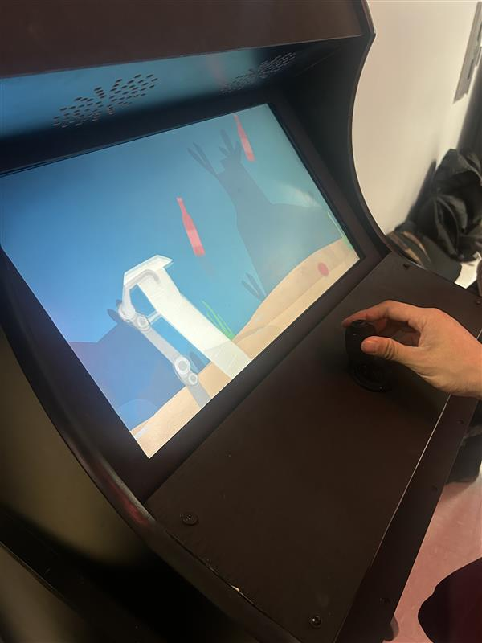
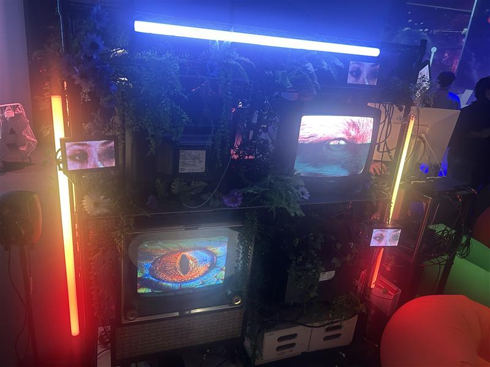

# 1
## Arbre en face
### Créateurs :
#### Alexandre Gendron, Mikael Arseneau, Mathieu Willet, Matis Ghariani et Rafael Angon Dube
### Installation en cours:

### Schéma d'installation :

> Source: https://mammouths.github.io/projet/#/
> Fichier: mise_en_espace_arbre_en_face.jpg
### Ce que je ressens en expérimentant l’installation : 
#### Je trouve le concept très amusant, c'est drôle et interactif! Avant d'avoir essayé l'expérimentation, j'entendais plein de personnes rire et dire "WOAA" puis je me demandais qu'est-ce qui pouvait être aussi drôle. Après l'avoir essayé, j'ai compris pourquoi, l'installation est très drôle et pas sérieuse du tout, j'adore. Elle permet d'avoir de multiples rires et de s'amuser en voyant nos visages dans les fleurs. Je n'ai vu aucune personne ne pas sourire en voyant le concept. Si je pouvais décrire cette installation en un mot, ça serait : "WOAAH"
# 2
## Symbiose
### Créateurs :
#### Yannick Chamberland, Benjamin Ferland, Ryan Dufault et Walid Cheour
### Installation en cours:

### Schéma d'installation :

> Source: https://les-chimistes.github.io/symbiose/#/
> Fichier: mise_en_espace_symbiose.webp
### Ce que je ressens en expérimentant l’installation : 
#### Je trouve que l'installation est très interactive. Avant l'expérimentation, je voyais beaucoup de gens être extrêmement concentrés et être très silencieux avant qu'ils perdent. Les gens voulaient recommencer et essayer à nouveau. J'étais curieuse de savoir pourquoi les gens voulaient autant jouer à nouveau. Après l'avoir expérimentée, j'ai découvert qu'il y avait des temps records que l'on pouvait dépasser. Après avoir échoué à une minute et 22 secondes, j'ai voulu recommencer pour battre mon record précédent. Je trouve que l'installation travaille beaucoup le travail d'équipe, la patience et la persévérance. Puis, si on échoue, on peut toujours recommencer et faire mieux.
# 3
## Mission
### Créateurs :
#### Ahmed Kaissoumi, Radhouane Kordan, Justin Montpetit, Thearylou Lach et Jad Saloumi
### Installation en cours:

### Schéma d'installation :

> Source: https://o-i-g-n-o-n.github.io/Mission-decollage/#/
> Fichier: mise_en_espace_mission.png
### Ce que je ressens en expérimentant l’installation : 
#### 
# 4
## Ocean Rouge
### Créateurs :
#### Amira Tounekti et Kristy Moussally
### Installation en cours:

### Schéma d'installation :

> Source: https://deux-intelligence.github.io/deux-neurones/
> Fichier: mise_en_espace_ocean_rouge.png
### Ce que je ressens en expérimentant l’installation : 
#### 
# 5
## Quand les yeux
### Créateurs :
#### Edelwyn Ledru, Félix Lavoie, Jade Hébert, Manel Yaya et Patricia Nassif
### Installation en cours:

### Schéma d'installation :

> Source: [https://deux-intelligence.github.io/deux-neurones/](https://emersiaa.github.io/Quand-les-yeux-se-croisent/#/)
> Fichier: mise_en_espace_quand_les_yeux.jpeg
### Ce que je ressens en expérimentant l’installation : 
#### 
