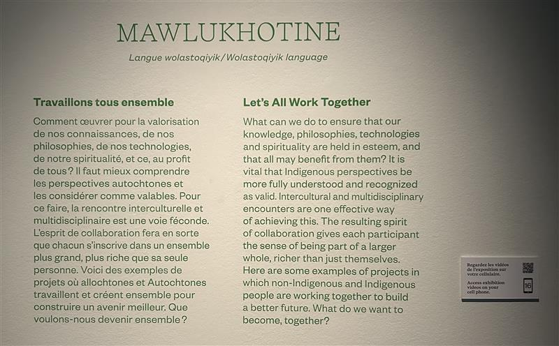
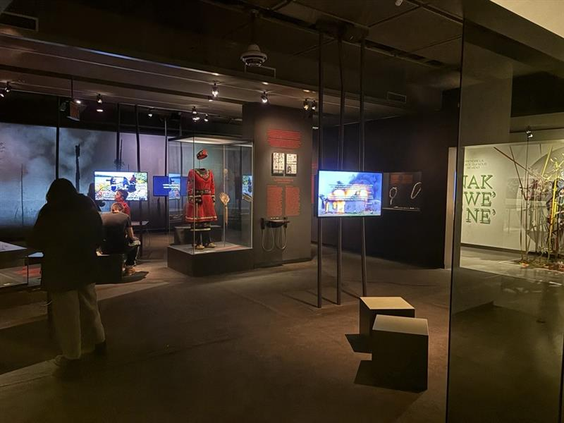
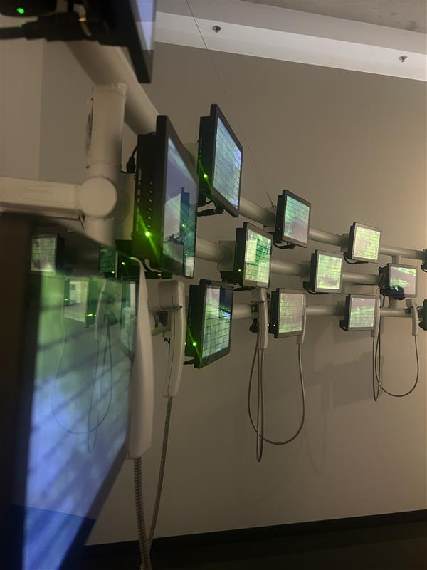
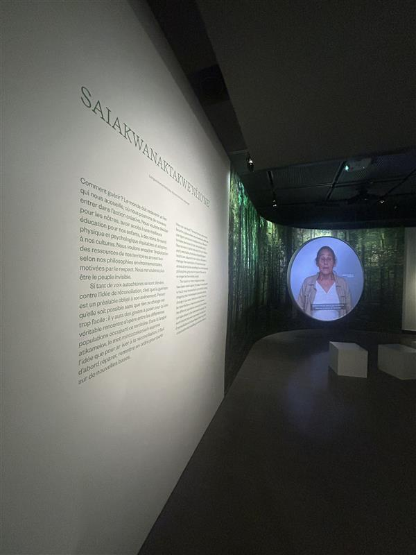
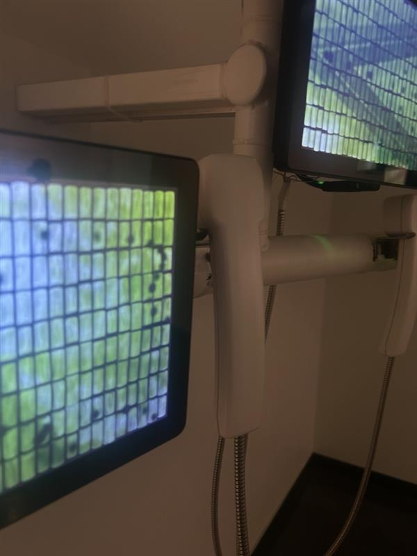

# Voix Autochtones d'aujourd'hui
## Savoir, Trauma, Résilience

###### Cette photo à été prise par moi
## Musée McCord Stewart Montréal

###### Cette photo à été prise par ma mère
## Type d'exposition: Permanente intérieur
### Date de visite : 3 Mars 2026
# Mawlukhotine

###### Cette photo à été prise par moi
## La Firme: Le Musée McCord, La Boîte Rouge VIF et BLVD-Rodeo FX
###### L'exposition à été réalisée par le Musée McCord, puis assuré et exposé par plusieurs personnes.
### Cette oeuvre à été réalisée en septembre 2021
### Le dispositif multimédia diffuse plein de différentes informations sur l'histoire des autochtones par des téléphones. Ils expliquent comment ils ont dû survivre en nature, dans les pensionnats, comment ils ont repris en main leurs vies en société après des traumatismes et comment ils ont essayé garder leurs savoirs.

#### Contrairement à plusieurs expositions, cette exposition-ci n'avait pas de cartel précis, mais plutôt des descriptions, des affirmations et des questions qui nous font réfléchir plus profondément.
###### Cette photo à été prise par moi
## Type d'installation: Contemplative ET Interactive

###### Cette photo à été prise par ma mère
### Fonction du dispositif multimédia 
> Mise en contexte, Support pédagogique et Diffusion du patrimoine immatériel
## Mise en espace
### Croquis de l'oeuvre

#### Cette exposition avait 3 salles, mais je n’en ai dessiné qu’une, car l’exposition est trop grande.
###### Cette photo à été faite par moi
## Composantes et techniques

> Un combiné téléphonique, plusieurs fichiers audiovisuelle et images fixes
###### Cette photo à été prise par moi
## Éléments nécessaires à la mise en exposition

> Mur, projecteurs, banc
###### Cette photo à été prise par moi
## Expérience vécue

###### Cette photo à été prise par moi
> Tu dois prendre le combiné téléphonique et écouter dans celui-ci pour en savoir plus sur l’histoire des autochtones, on a aussi des petits écrans pour un support visuel. Il y a plusieurs paires de combinés téléphoniques pour laisser la chance à plusieurs personnes d’accéder aux informations.
#### Appréciation: J’ai beaucoup apprécié cette exposition, j’ai appris beaucoup d’informations et ai pu me cultiver plus sur l’histoire des autochtones et comment ils ont combattu pour leurs droits jusqu’au bout. Pas beaucoup de personnes s’y connaissent sur leur vécu et cette exposition vous permet d’y en savoir davantage. De plus, le fait d’avoir des combinés téléphoniques pour y écouter est une très bonne idée qui est originale.
#### Critiques: Je trouve qu’il n’y avait pas beaucoup de dispositifs interactifs et j’aurais voulu plus de variété multimédias.
### Références: Photos prise pas Rosa-Lee Savoie (Moi) et Sabrina Tessier (Ma mère) 
