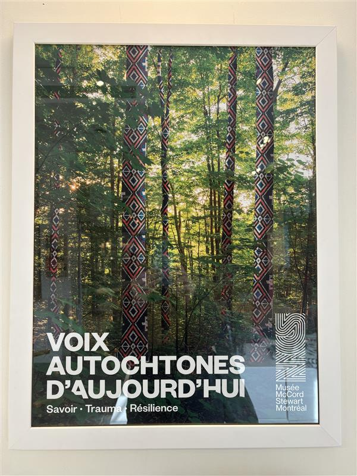
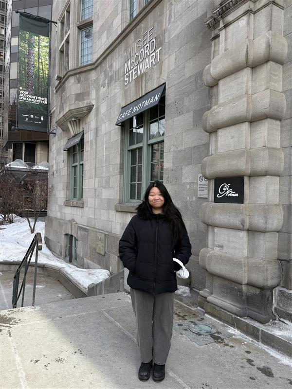
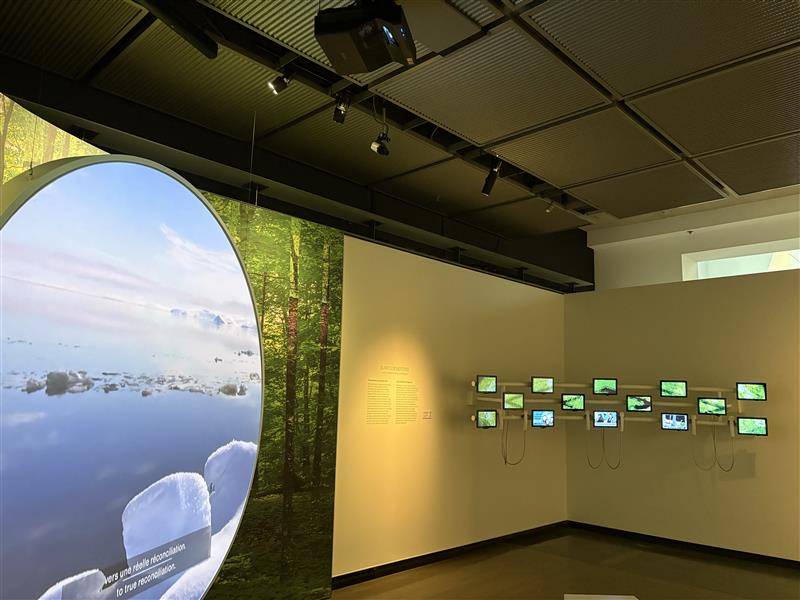
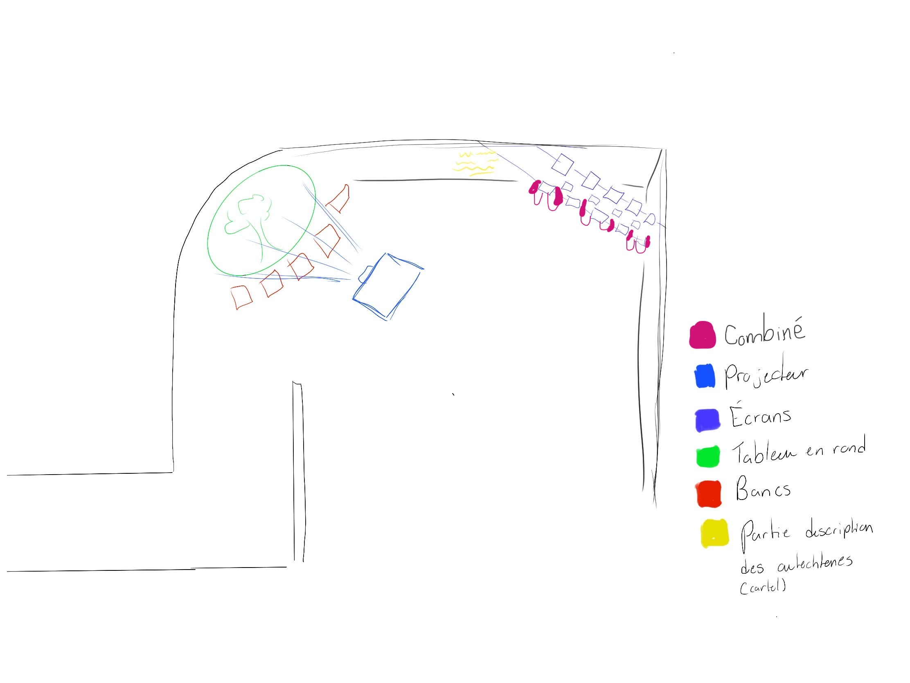

# Voix Autochtones d'aujourd'hui
## Savoir, Trauma, Résilience

###### Cette photo à été prise par moi
## Musée McCord Stewart Montréal

###### Cette photo à été prise par ma mère
## Type d'exposition: Permanente intérieur
### Date de visite : 3 Mars 2026
# Mawlukhotine

###### Cette photo à été prise par moi
# Croquis de l'oeuvre

###### Cette photo à été faite par moi
## La Firme: Le Musée McCord
###### L'exposition à été assuré et exposé par plusieurs personnes, mais à été réalisée par le Musée McCord.
### Cette oeuvre à été réalisée en septembre 2021
### 
