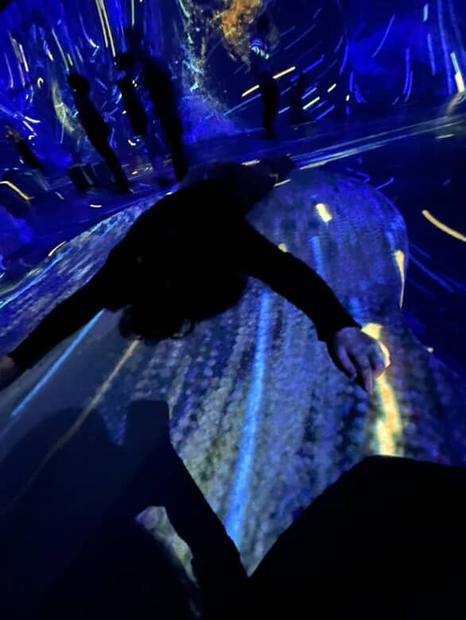

# Savoie Rosa-Lee

> Moi représenté au Oasis Immersion 23 octobre 2025
## Intérêt dans le Multimédia
J'apprécie beaucoup la musique, l'art numérique et les art en général. En temps que persone qui fait de l'art numérique dans la vie de tout les jours j'ai bien aimé le cours d'illustration numérique et j'apprécie bien le cours d'animation 2D dans mon programme TIM à Montmorency. J'adore les artistes qui font des illustration numérique très complet et détailler mais j'admire encore plus eux qui font des séries animées.
À consulter ici : https://youtu.be/wKqmEKkoDx0?si=p-Uo6b4ZqNV-bIwE
